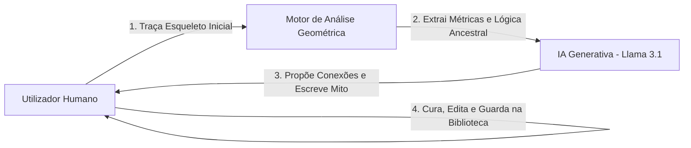

# Defesa Académica: Co-criatividade e Criatividade Computacional no *StarForge*

Este documento apresenta a fundamentação teórica e a classificação do projeto sob a perspetiva da **Criatividade Computacional (CC)**, estruturado como um guião de defesa para o júri docente.

---

## 1. Paradigma de Interação: Co-criatividade Humano-Computador (Mixed-Initiative)

O *StarForge* não foi concebido como um agente autónomo isolado, mas sim como um **sistema co-criativo de iniciativa mista (Mixed-Initiative Co-creative System)**. O processo criativo desenrola-se num ciclo de *feedback* dinâmico onde ambos os agentes (humano e máquina) operam no mesmo espaço conceptual:

*   **Iniciativa Humana:** O utilizador define a intenção inicial, selecionando as estrelas no firmamento 3D e traçando o "esqueleto" básico (linhas iniciais).
*   **Iniciativa Computacional:** O sistema analisa a topologia do grafo, extrai métricas físicas e estéticas das estrelas, e propõe uma expansão estrutural e uma narrativa mitológica baseada em restrições lógicas e poéticas.
*   **Curadoria:** O utilizador atua como curador final, aceitando, guardando ou reajustando a peça na sua biblioteca através de ações iterativas (como o botão *Desfazer* ou remoção de linhas).

---

## 2. Enquadramento segundo a Tríade de Margaret Boden

De acordo com o modelo clássico de Margaret Boden, um artefacto ou sistema é criativo se demonstrar **Novidade**, **Valor** e **Surpresa**:

### A. Novidade (Novelty)
O sistema opera sob o conceito de **P-Novidade (Novidade Psicológica)** para o utilizador, gerando constelações que nunca existiram nos registos históricos e lendas originais. 
*   **Novidade Combinatória:** Cruza uma base de dados astronómica real (Catálogo HYG de 300 estrelas) com um motor semântico que gera narrativas em tempo real. Cada iteração produz um mito inédito de raiz.

### B. Valor (Valor)
O valor de uma constelação reside na sua **coerência dupla**:
1.  **Coerência Geométrica (Sintática):** O algoritmo de conclusão proíbe linhas cruzadas, filtra nós flutuantes (garante conexões únicas e contínuas) e restringe sugestões à janela visível do observador (*Filtro Anti-Costas*).
2.  **Coerência Narrativa (Semântica):** O mito gerado não é um texto aleatório. O motor semântico lê os parâmetros físicos das estrelas selecionadas (a magnitude de brilho e o índice de cor) e justifica-os na lenda (catasterismo). Uma estrela super-brilhante torna-se o herói; uma estrela vermelha (tipo-M) torna-se fogo ou guerra; uma gélida estrela azul-branca torna-se divindade ou magia.

### C. Surpresa (Surprise)
A IA surpreende o utilizador ao expandir o seu conceito inicial através de caudas lineares, asas simétricas ou anéis que fecham ciclos (estruturas que o utilizador não tinha planeado inicialmente). O utilizador desenha um traço simples e a IA propõe um "monstro alado" ou uma "serpente cósmica", expandindo o seu espaço de representação visual.

---

## 3. O Espaço Conceptual e a Lógica de Mapeamento (Ritchie's Framework)

A grande inovação criativa deste projeto é a **tradução de dados quantitativos (ciência) em conceitos qualitativos (arte/mitologia)**. O sistema define um espaço conceptual rigoroso que mapeia métricas geométricas para arquétipos de design:

| Métrica Geométrica / Física | Cálculo Computacional (NumPy) | Arquétipo / Instrução Semântica | Impacto no Mito gerado |
| :--- | :--- | :--- | :--- |
| **Alongamento (Elongation)** | Razão entre a distância máxima ao centroide e a média. | Caminho linear vs. Forma Fechada. | Determina se é uma Serpente/Rio ou uma Coroa/Escudo. |
| **Magnitude Média (mag)** | Magnitude aparente média das estrelas do esqueleto. | Estatuto Divino (Divino, Heroico, Mortal). | Define se a lenda envolve Deuses Supremos, Monstros ou Humanos. |
| **Cor Espectral (Color Index)** | Mapeamento B-V para Hex Color real da estrela. | Temperamento Elemental (Espiritual, Terrestre, Éter). | Associa a lenda a elementos como Fogo Cósmico, Terra, Gelo ou Trovão. |
| **Ascensão Reta (RA)** | Ângulo calculado via `atan2(y, x)`. | Época de Visibilidade (Estação do ano). | Define o cenário temporal (Inverno gélido, Primavera fértil, etc.). |
| **Latitude Galáctica ($b$)** | Projeção vetorial sobre o polo galáctico ($\vec{n}_{ngp}$). | Proximidade da Via Láctea. | Integra na narrativa a travessia pelo "Rio de Estrelas" ou "Vazio Cósmico". |

---

## 4. O Motor Criativo: Conexão Contexto-Estrutura (Context-Aware Design)

O projeto demonstra criatividade ao aplicar **Instruções de Estilo de Desenho Dinâmicas** baseadas no *feedback* visual. Em vez de ligar estrelas aleatoriamente, a IA recebe uma diretiva topológica:
*   Se a silhueta calculada for uma *Serpente*, a IA é instruída a desenhar em **cadeia linear contínua** (propondo ligações consecutivas).
*   Se for um *Escudo*, a IA é orientada a **fechar ciclos geométricos** (criando anéis fechados de estrelas).

Isto demonstra uma **compreensão semântica da forma** pelo agente computacional, elevando o projeto de um simples assistente de desenho para um parceiro criativo inteligente.

---

## 5. Conclusão da Defesa (O "Pitch" para os Docentes)

> *"Senhores docentes, o projeto StarForge aborda a Criatividade Computacional não como uma automatização mecânica da arte, mas sim como uma ponte entre a astrofísica e a mitologia clássica. Através de um sistema co-criativo, permitimos que o utilizador colabore com uma inteligência que compreende a geometria tridimensional do céu e a traduz em catasterismos mitológicos coerentes. Ao alimentar o modelo de linguagem com as magnitudes físicas e cores reais das estrelas, garantimos que a arte visual gerada e a lenda escrita estão intrinsecamente unidas pelos mesmos dados científicos. É a computação ao serviço da expansão do espaço conceptual humano, reavivando a milenar tradição de olhar para o céu e contar histórias."*
